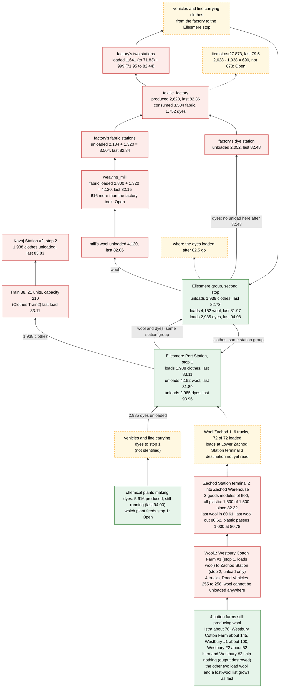

# Worked example: a train with nothing to carry

Not a format note. The goal of this folder is to test whether the repo has the information and the tooling to support a player-style analysis, and to record where it does not. This first example asks "where are the bottlenecks on this line?" and shows how the [statistics lists](../statistics-lists.md) answered it and what the answer rested on. Each step names the note that holds the underlying fact. Names of lines, stops and industries are as they appear in the published save. Checked on 604, one game: catalog save [6425796](https://mod.io/g/transportfever3/m/mynewsavenotfinished1) (temperate, no mods, clock 94,328,800, shown date 18 February 1937). Cargo ids are the base game's ([cargo-ids.md](../cargo-ids.md)): `wool` 25, `fabric` 26, `dyes` 2, `clothes` 27.

## Does the repo support this? (first verdict)

| Need | In the repo | Status |
|---|---|---|
| Cargo ids for the save, recipes, which industry makes what | `tf3save.cargo_list`, [cargo-ids.md](../cargo-ids.md), [industry-chains.md](../industry-chains.md) | Supported |
| Clock, calendar speed, date of a clock value | `tools/calendar_speed.py`, [calendar.md](../calendar.md) | Supported |
| Read the `items*` lists, group them, difference per period to the save's clock | [statistics-lists.md](../statistics-lists.md) and `tools/items_lists.py` (`--cargo`, `--table`, `--entries`) | Supported since the tool was promoted from private and throwaway scripts; before that this was a gap. Its figures matched the earlier hand-made table on this save |
| Say which group belongs to which stop, industry or line | none; matched by equal totals and per-period figures | **Gap** (**Open** in [statistics-lists.md](../statistics-lists.md#groups)) |
| Say which vehicles run a line, and where they are | none; [vehicles.md](../vehicles.md) ties vehicles to depots and slots only | **Gap** (**Open**) |
| Say why a stage stopped (road or track cut, vehicles sold or stuck, a line that cannot unload) | the notifications state: `line_warning` entries (issue type, stop, cargo) and `cargo_rtc_warning` entries, with the game's script text ([notifications.md](../notifications.md#params-by-type)); `vehicle2problem` for standing vehicles | Partly: the warnings name the class of cause and the cargo (wool loaded at stop 1 and unloaded nowhere, at clock 80.74M), the game's window for Wool1 confirmed that reading, and the warned trucks can be placed on a line by name; but an entry gives a line's entity id, not its name or stops |
| Line stops and the stops' cargo configuration | [lines.md](../lines.md) documents the stop times and the unload flag; the load list and the departure choice are **Open** | **Gap**: a screenshot of the line window confirmed the line's two stops and their settings, but the save cannot yet be read to tie a line to its stops, so the identification above rests on figures |
| Say which stops belong to one station | none; found here by sums: a group's lists equal the sum of two other groups' ([statistics-lists.md](../statistics-lists.md#groups)) | Partly: the grouping shows in the figures, the stop and station names are not tied to the groups (**Open**) |

Verdict: the notes were enough to explain what happened and when. They were not enough to say which line, which vehicles or why. The list reading, the one step that had no public tool, is now `tools/items_lists.py`. Add to the table when another example is tried.

## The question and the starting figures

The Lines tab showed a rail line with Load 0, Utilization 0%, capacity 210 and Frequency 27 min 23 s. Frequency and Rate are explained in [lines.md](../lines.md#the-lines-windows-frequency-rate-and-load-columns-604). Load 0 says the line is empty now, not why.

## Method

1. **Find the stages.** The chain is `cotton_farm` (`wool`), `weaving_mill` (`fabric`), `textile_factory` (`fabric` and `dyes` into `clothes`), then a warehouse. The recipes are in [industry-chains.md](../industry-chains.md).
2. **Difference every list per period.** Take each stage's `items*` totals at multiples of 1,461,000 clock units, from period 1 to the save's clock (here period 65), and print every period, trailing zeros included. `tools/items_lists.py` does this. A reader that stops at a fixed number of periods, or drops trailing zeros, shows an old game wrongly and hides exactly the stages that stopped (**Confirmed**: an earlier private reader capped at 39 periods gave wrong figures here). See [statistics-lists.md](../statistics-lists.md#the-yearly-bars-are-periods-of-1461000-units-604).
3. **Read each list's last entry time, not only its total.** A stage that stopped has a last entry long before the save's clock.
4. **Identify the line by its figures.** The loading stop's `itemsLoaded` showed loads of 210, the line's capacity. Its total (1,938) equalled the total unloaded at the warehouse stop. Each load was unloaded about 660,000 units later. A match like this is **Observed**; the line-to-vehicle link itself is **Open** ([vehicles.md](../vehicles.md)).
5. **Use clock units, not dates.** This save's calendar had been stopped since clock 76,984,000 ([calendar.md](../calendar.md#the-day-table)), so every event after it has the same shown date.

## What the lists said (604, Observed)

| Stage | Last entry in the clock | Periods before the save |
|---|---|---|
| Clothes loaded at the line's loading stop | 83,108,800 | about 7.7 |
| `clothes` produced | 82,364,800 | about 8.2 |
| `fabric` delivered to the `textile_factory` | 82,343,600 | about 8.2 |
| `wool` delivered to the `weaving_mill` | 82,063,800 | about 8.4 |
| `dyes` delivered to the `textile_factory`'s station | 82,482,200 | about 8.1 |
| `dyes` loaded at the Ellesmere stop that feeds it | 94,083,400 | still loaded |
| `wool` produced at the four `cotton_farm`s | 94,261,200 | still produced |

- **The line is starved, not slow.** The `textile_factory` had no input after the `weaving_mill` stopped, and the mill had no wool. The factory had taken in about 300 more dyes than it used (2,052 against 1,752), so dyes were not the limit. They stopped arriving at the factory's station at 82,482,200, 0.1 periods after its last use, while the Ellesmere hub kept taking in and loading about 120 a period; where those later dyes go is **Open**.
- **The farms' wool is not collected.** Their `itemsLost` lists grew by about what they produced in each of the last periods (for one farm 57 to 116 lost against 96 to 104 produced). Whether that is spoilage, a full output or something else is **Open** ([spoilage.md](../spoilage.md#the-itemslost-lists)).
- **The lists do not say why wool stopped; the notifications and the warehouse do.** `line_warning` entries were raised at clock 80,402,400 (planks, one line) and 80,744,000 (three entries). Two of those three are about wool (cargo 25): wool configured on a line but loaded nowhere, and wool loaded at stop 1 and unloaded nowhere. That is inside the window where the wool lists end (80.6M to 82.06M). Trains 57 and 17 had `cargo_rtc_warning` ("Cargo Unload Problem") at 79.8M and 80.1M, with 72 and 60 cargo not unloaded; Trains 61, 58 and 60 followed at 82.7M, 83.1M and 87.6M. The numeric issue types are read from the game's script and their match to numbers is an inference (**Open**, [notifications.md](../notifications.md#params-by-type)). Warnings about where cargo can be unloaded point at a line's stops or cargo configuration rather than at a blocked vehicle, but that is a reading of the warning text, not yet checked in the game. The 58 entries of `vehicle2problem` are all within about 1.2M units of the save's clock, so no vehicle has stood still since the wool stopped ([notifications.md](../notifications.md#bookkeeping-tables)).

## When the line did limit the chain

In periods 51 and 52 the factory's trucks brought 366 and 270 `clothes` to the station while the line loaded 210 in each period, so about 216 were left waiting. In the next three periods the factory's `itemsLost27` grew by 107, 75 and 37, which is 219 (**Observed**: the figures agree, nothing was tested). After period 53 the factory made only 70 to 90 a period, under half of what the line could move (a loop took 1.25 to 1.56 million units, one load of 210 a period), so the line's size stopped mattering.

An earlier gap is also visible: in periods 36 to 44 the factory's lost list grew by about as much as it produced, while the line had no loads (its first loads were in periods 25 to 27 and it resumed in period 45). Something else carried the cargo, or nothing did (**Open**).

## The line window (screenshots of the Lines tab)

- **The line** has one vehicle, Train 38 with 21 units, and two stops. Stop 1, Ellesmere Port Station, loads `clothes` at 100%. Stop 2, Kavoj Station #2, has no load configuration, so it only unloads. This matches the figures: loads of 210 at one stop, and the same 1,938 unloaded at the other.
- **Both stops hold the defaults** (Min. Stop Time 0 s, Max. Stop Time 10 min, Max. Additional Wait 60 s; [lines.md](../lines.md#the-stop-configuration-record)). The train therefore leaves after at most the stop time with whatever it has, which fits the part loads (114, 18, 48) while the factory's output was thin. Its loops were 1.25M to 1.31M units with no wait and 1.56M with about 0.3M of waiting, never the 0.6M that 10 minutes would be. The Departure Configuration choice shown (the first of three icons) is not decoded (**Open**).
- **No line problem is flagged** on this line (15 lines had one, none this one), so the game sees nothing wrong with it: it is idle.
- **The Lines tab sorted by problem** shows the red marker on, among others, Wool1 (4 trucks, capacity 48), Wool Zachod 1 (6 trucks, 72 of 72 loaded, so full) and Wool, Wood, Gas, Meat, Plastic 1 (4 trains of 16 wagons). The Vehicles tab shows a problem on only two vehicles, Train 2 (Fish Elba) and Train 37 (Train Line 2), so the wool lines' problem is on the line, not a vehicle. The game prints the issue text when the marker is hovered.
- **The Industries tab** names the wool sources: four `cotton_farm`s (Istra Cotton Farm, Westbury Cotton Farm, Westbury Cotton Farm #1, #2), with outputs 79, 92, 101 and 53 and shipments 0, 144, 104 and 0. The livestock farms show no output and no input. The `weaving_mill`s (Ellesmere Port Weaving Mill, its West one, Shama) and the Ellesmere Port Textile Factory all read input 0 and output 0. Matched to the lists by rate and shipment (**Observed**): Istra is the 78-a-period farm and Westbury Cotton Farm the one with 144 shipped; the two with shipment 0 are the two whose output is destroyed because nothing loads it.
- **Wool1, read in the game.** The line has two stops: Westbury Cotton Farm #1 (loads wool at 100%) and Zachod Station (no load configuration, unload only), and four trucks, Road Vehicles 255 to 258, of which three carry the unload-problem icon. Its window says "A cargo type cannot be unloaded anywhere, despite being loaded at stop 1. Cargo Type: Wool", and hovering its band on the road reads "Some Cargo Type Configurations of This Line Are Clashing". Its Transported bars are flat at about 100 a year to the present (104 last year, the farm's shipment), while its income bars are large early and near zero since: the line keeps loading wool it cannot deliver. This confirms the line warning reading above. Why Zachod Station cannot unload wool (no wool consumer in reach of the stop, or a changed station) and whether Zachod Station is the Ellesmere stop group are **Open**.
- **The cotton farms' windows** agree with the lists: Westbury Cotton Farm #2 and Istra Cotton Farm sit at 300 of 300 output with Destroyed equal to Produced every year since 1930 (no line has ever served them). Westbury Cotton Farm #1 has 0 of 300 (everything is taken, by Wool1) and no destroyed cargo. Westbury Cotton Farm sits at 268 of 300, its production risen from about 50 to about 150 a year part-way along the chart (the date labels under the bars are not reliable once the calendar stopped), with little destroyed.
- **The cause: the warehouse's goods space is full of plastic (the player's guess, confirmed by the lists and windows).** Zachod Station (four lines, terminal 2 is Goods and serves Wool1) sits between a chemical plant and Zachod Warehouse. The warehouse window shows three Goods modules of 500, every one plastic (500 of 500 each), plus flatbed 132 of 500 and liquid 488 of 500. The warehouse's statistics group (unloaded minus loaded per cargo, [statistics-lists.md](../statistics-lists.md#stock--unloaded-minus-loaded)) gives the plastic stock over time: it sat at 964 to 1,012 from at least clock 76.0M (so two modules' worth), the last wool arrived at 80,607,800 and the last wool left at 80,619,000 (wool stock 0), the wool line warnings came at 80,744,000, plastic jumped past 1,000 at 80,779,600 (+124), and the stock reached 1,500 at 82,321,600 and has stayed there. A third module that wool had used was emptied of wool and then claimed by plastic (**Observed**, one game; that goods modules are claimed this way is **Open**, [warehouses.md](../warehouses.md)). The chemical plant that makes the plastic also makes the dyes: plastic produced 14,040, loaded 9,708, lost 4,874, destroyed 4,038 (to clock 79.56M). Zachod Station's own Unloaded bars stop part-way along its chart while the Loaded bars continue.
- **A queue of three stuck trains is not involved.** Train 37 (Train Line 2) reads "no electrified path", with Train 33 (Fish Elba) and Train 48 (Train Line3, the tail) waiting for a free path behind it. None of these lines carries a wool, fabric, dye or clothes cargo of this chain. The save dates the jam to about 93.26M: a `vehicle_warning` for Train 37 and two `line_warning` entries with `lineProblem` 4 share that timestamp, and the `stuck_vehicle` entries start at 93.35M. That is about 11M units after the wool stopped, so it cannot be the cause. Hovering the Fish Elba band on the track (the line overlay shows the line name and its problem) reads "Could Not Connect Stations". Train 33's own "89 cargo was not unloaded" warning is from 87.83M, before the jam, and is a separate problem on the fish line.
- Whether the train is waiting at stop 1 or running empty now is **Open**: Frequency 27 min 23 s lies between an empty loop with no wait (about 22 minutes) and one with the full 10 minutes (about 33).

## The trail backwards from stop 1

Only the `clothes` supply chain that feeds Train 38 is drawn. Arrows follow the cargo, so read from the bottom (sources) up to the train at the top. Clock values are in millions of units ("last" is the last list entry; the save is at 94.33M). Green holds up to the save, red stopped, yellow with a dashed edge is where the trail is lost (the tools or the notes cannot follow it).

Where the trail is lost, from the train backwards:

1. **Stop 1 to stop 2 and back** is solid: 1,938 loaded, 1,938 unloaded, 210 a trip.
2. **The two Ellesmere stops are one station group.** The group's lists equal the sum of the two stops' lists (unloaded 9,575 = 2,438 + 7,137), so wool and dyes arrive at stop 1 and leave from the second stop, and clothes the other way. Which stop is the train's (stop 1) comes from the line window; the lists alone cannot name a stop (**Open**).
3. **Clothes from the factory to the Ellesmere stop:** the amounts fit (999 and 1,641 loaded at the factory's two stations, 1,938 unloaded at Ellesmere), but the 690 that never arrived is not the 873 on the lost list. Which vehicles and line made the trip is **Open**. A clothes line named after Kavoj and another named Clothes 1 exist, but nothing in the save links them to these lists.
4. **Fabric and wool:** the mill and the factory's fabric stations reconcile (4,120 loaded against 3,504 unloaded, 616 apart, **Open**), and the wool loaded at the Ellesmere stop and unloaded at the mill reconcile (4,152 and 4,120).
5. **From the farms to stop 1 the vehicles are lost, but a cause shows.** The four cotton farms still produce. Two (Istra and Westbury #2) ship nothing: their output is destroyed at a full stock. The other two load wool, and a lost-wool list grows about as fast. No `itemsUnloaded25` list has an entry after 82,063,800 anywhere. The line warnings at 80.74M say wool was loaded at stop 1 of a line with no stop to unload it. Wool1 is one of the lines (confirmed in the game, above); the warehouse that its wool should enter is full (above). The others are **Open** (a line's entity id is in `line2problemTimestamp`; its name is not tied to it). Wool Zachod 1 and Wool, Wood, Gas, Meat, Plastic 1 are flagged in the Lines tab and are the first lines to open in the game: hover the marker, or the line's coloured band on the track near its stops (the line overlay), for the issue text, then check which stop of the line has wool in its load list and whether any later stop is the weaving mill's.

## What the method cannot give

- Which vehicle or line owns a group. Groups are matched by figures ([statistics-lists.md](../statistics-lists.md#groups)).
- Why a stage stopped. The lists show that it did and when.
- A date for any event once the calendar is stopped; use the clock.
