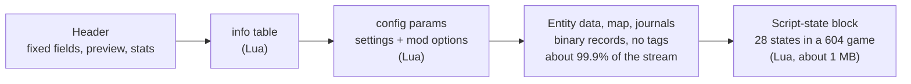
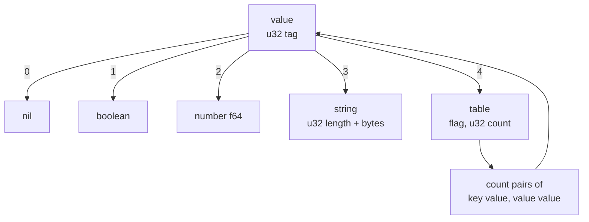
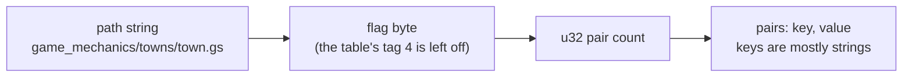

# Lua data in a save: the big picture

A short map of the Lua part of a save: where it sits, how many layers it has, what the file labels itself and what we had to work out. The details are in [lua-values.md](lua-values.md) (the byte encoding) and [script-states.md](script-states.md) (the states one by one). Checked on 604 (one played game of ours, no mods; the header and settings points also on 599 to 604, 22 catalog saves). Counts and depths are for that save.

## Where Lua sits in the stream

Most of a save is not Lua. The header holds two Lua tables, and one block of script states sits near the end. Everything between them (entities, vehicles, people, the map) is binary records with no tags.

| Part | Lua? | Notes |
|---|---|---|
| Header fixed fields | no | [header.md](header.md) |
| `info` | yes | One table, `company` then `level`: two layers |
| `config params` | yes | A list of (id, table). The empty id holds the game settings, other ids are mods' options ([mods.md](mods.md#mod-options)) |
| Entity data and the rest of the middle | no | Not self-describing. Read record by record, see [town-records.md](town-records.md), [models.md](models.md), [lines.md](lines.md) |
| Script states | yes | One block, about 98% of the way into a 946 MB stream, the states nearly back to back (**Observed**, 604) |

The settings table is flat: its keys are the dotted names (`map.size`, `advancedOptions.cargoIncome`), one layer, no nested tables. **Observed** on 599 to 604 (22 catalog saves and ours). [settings.md](settings.md) has the options.

## The layers inside a value

A value is a tag and a payload. Only a table holds other values, so depth is the depth of tables inside tables. Arrays are tables with numbers as keys and count as a layer.

## A script state on disk

States follow each other in the block, each starting at its own path string, and a state ends where its last pair ends. In the 604 save the block was about 3 KB longer than its 28 states added up, so a few bytes sit between some states (not looked at). **Observed**, 604.

## How many and how deep (604, one save)

Depth counts the state table as layer 1.

| Group | States | Layers | Examples |
|---|---|---|---|
| Flat | 5 | 1 | `game_time.gs`, `reforestation.gs`, `context_helper.gs` |
| Shallow | 11 | 2 to 3 | `achievements.gs`, `loan.gs`, `mission.gs`, the small HUD states |
| Medium | 9 | 4 to 6 | `landmarks.gs`, `vehicle_modifier.gs`, `company.gs`, `town.gs`, `industries.gs` |
| Deep | 3 | 8 to 10 | `industry_workers.gs` (8), `notifications.gs` (9), `subventions.gs` (10) |

The 28 states take about 1.05 MB together. `industries.gs` is two thirds of that. The deep ones are lists of records, each record a table whose fields hold further tables. The music player's table has no script path and is not counted here ([script-states.md](script-states.md#the-music-player-state)).

## What the file labels and what it does not

| In the stream | Not in the stream |
|---|---|
| Each state's script path | What a number means (seconds, a day count, an index) |
| Every key name, as a string | Which time base a time uses, see [calendar.md](calendar.md) |
| The type of every value (the tag) | That a numeric key is an array position rather than an id |
| How long every table is | Where the block starts: found by searching for a path |
| | Names for numeric ids, see [cargo-ids.md](cargo-ids.md) |

So a reader needs no schema to walk a state, but needs the game's files or a test in the game to say what a field is.

## Where the game explains the states

The game's script archives (`base/content`, modder-facing) say a good deal about the saved states. These are facts read from them, in our words:

- **A state is a game script's table.** The script API has a `getState` call on the game script repository that returns a table (`api/tealdef/api/res.d.tl`). A game script is described by up to five hooks: update, post-update, handle event, GUI update and GUI handle event (`GameScriptDesc` in `api/tealdef/api/type.d.tl`).
- **Each saved path has a declaration file.** The stored `x.gs` matches an `x.gs.lua` in the archives, which only names the script functions the game calls. For example `game_mechanics/game_time/game_time.gs.lua` in `game_mechanics.zip`. 24 of the 28 states have one: 17 in `game_mechanics.zip`, 5 in `gui.zip` and 2 in `mission.zip`. `industry_workers.gs`, `landmarks.gs`, `reforestation.gs` and `vehicle_modifier.gs` have none in the data archives; where they are declared is **open**.
- **The key names are declared as types.** The `.d.tl` files beside a script declare a record for its state. `game_mechanics/game_time/game_time.d.tl` lists the keys of the weather and time state with their types, matching what the save holds. They also list the allowed values of the mode strings (`Constant`, `Automatic`, `Local`, `Dynamic`), so `Local` is a real value of the time-of-day mode.
- **`version` is a schema number.** 10 of the 28 states have a `version` key (604 values: `game_time` 1, `emissions` 2, `subventions` 2, `achievements` 4, `company` 4, `celebrations` 5, `mission` 5, `guide_system` 5, `town` 8, `notifications` 24). The game's scripts compare it with the current number when they start and upgrade an older state (seen in `game_time.script.tl` and `towns.script.tl`). The other 18 have none. A save from an older game version can therefore hold older state shapes.

Facts about what each key means still come from tests in the game; the type files give names and types, not units.

## Open

- Where `industry_workers.gs`, `landmarks.gs`, `reforestation.gs` and `vehicle_modifier.gs` are declared.
- What follows the script-state block, and whether the music player state sits inside it.
- Depth and state counts on versions other than 604, and with mods (a mod adds its own states).
